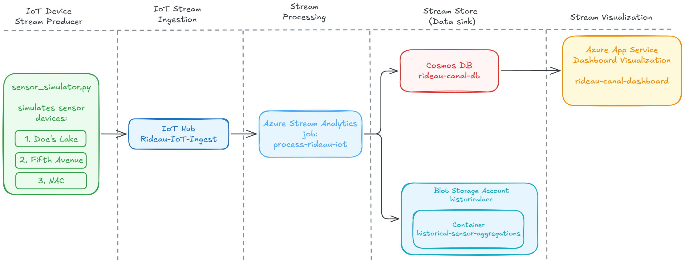
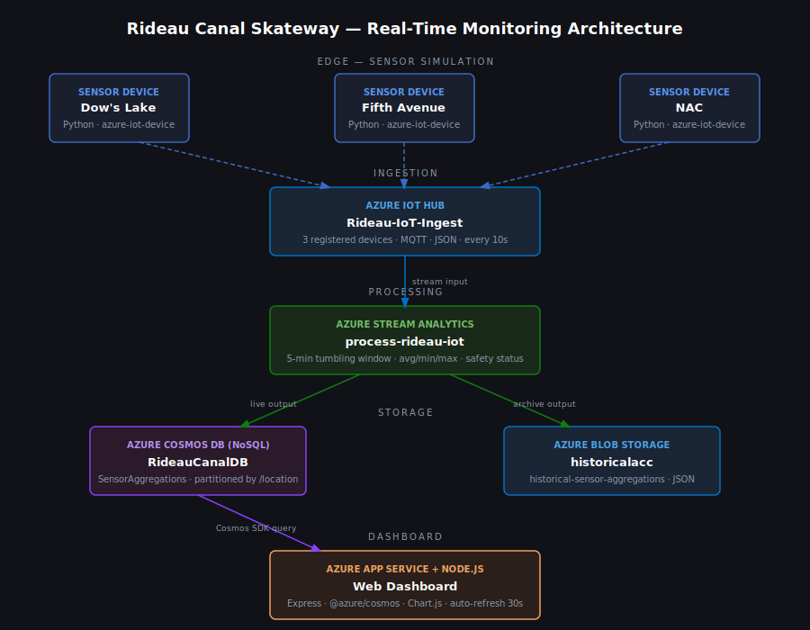
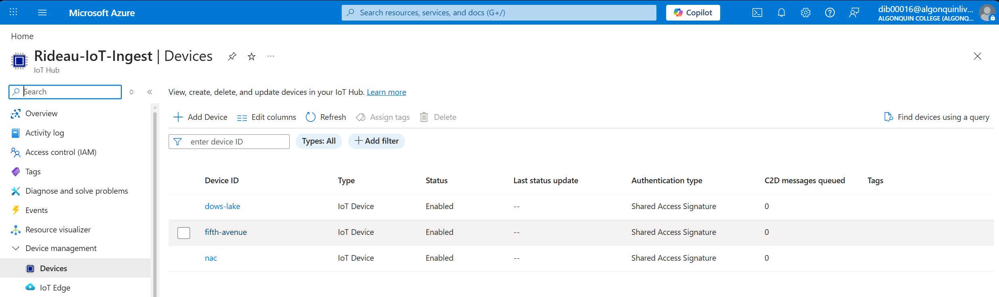
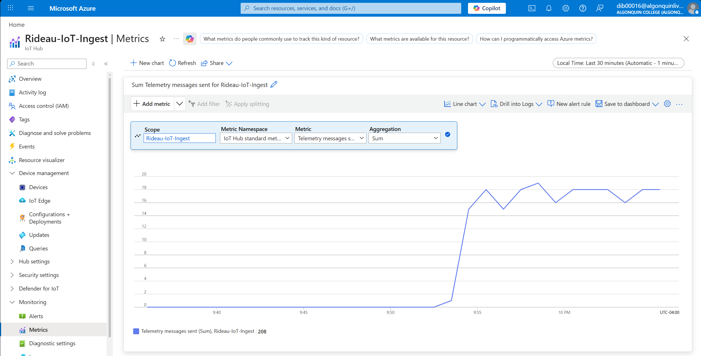
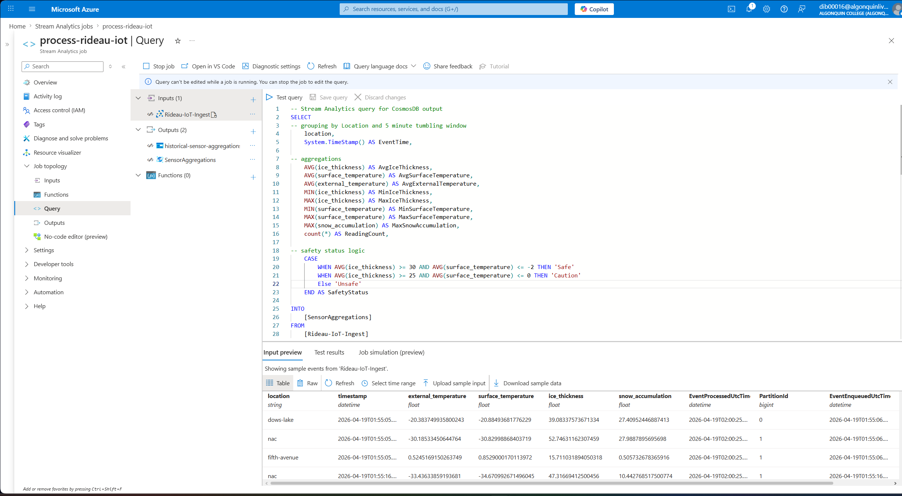
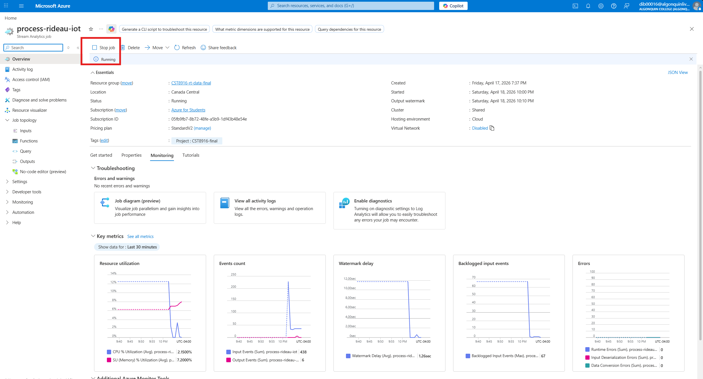
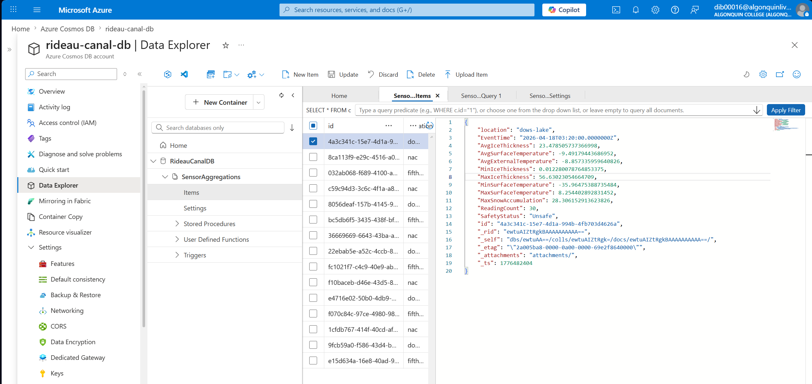
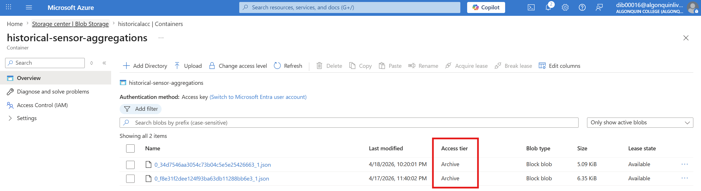
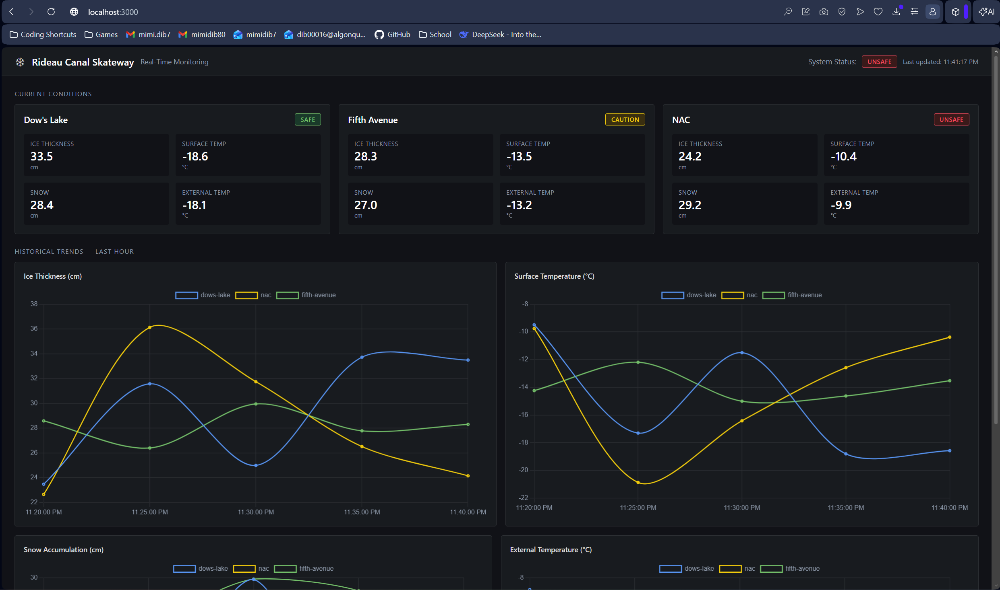
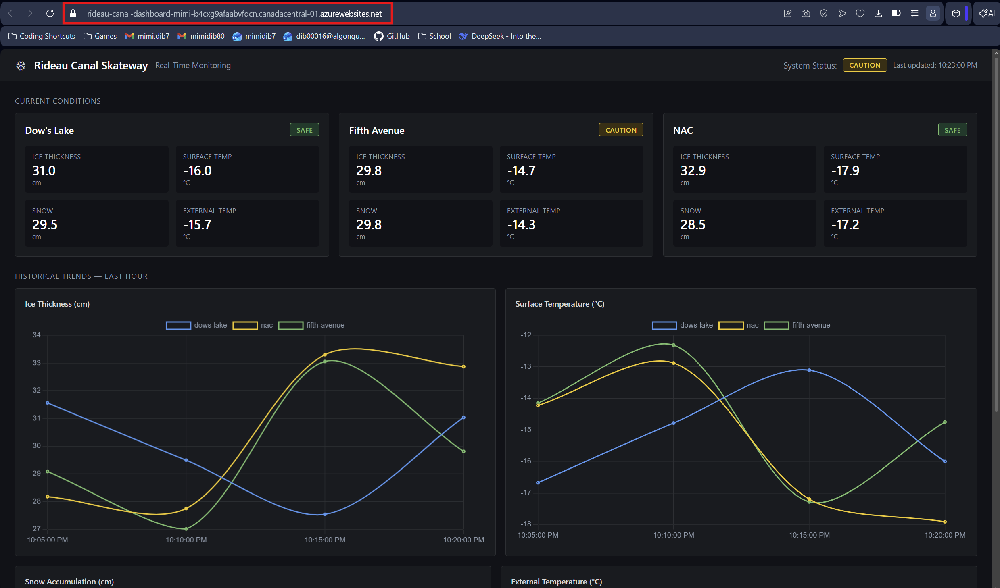

# Rideau Canal Skateway — Real-Time Monitoring System

A real-time IoT data streaming and visualization system for the Rideau Canal Skateway in Ottawa, built on Azure cloud services.

---

## Student Information

- **Name:** Mimi Dib
- **Student ID:** 040829779
- **Course:** CST8916 — Remote Data and Real-time Applications

### Repository Links
- **Sensor Simulation:** [https://github.com/mimidib/rideau-canal-sensor-simulation](https://github.com/mimidib/rideau-canal-sensor-simulation)
- **Web Dashboard:** [https://github.com/mimidib/rideau-canal-dashboard](https://github.com/mimidib/rideau-canal-dashboard)
- **Live Dashboard:** [https://rideau-canal-dashboard-mimi-b4cxg9afaabvfdcn.canadacentral-01.azurewebsites.net](https://rideau-canal-dashboard-mimi-b4cxg9afaabvfdcn.canadacentral-01.azurewebsites.net)

---

## Scenario Overview

### Problem Statement
The Rideau Canal Skateway is one of the world's largest natural skating rinks. The National Capital Commission (NCC) must continuously monitor ice conditions across multiple locations to ensure skater safety. Manual inspection is infrequent and cannot detect rapid changes in ice thickness or surface temperature.

### System Objectives
- Continuously collect ice and weather data from three locations every 10 seconds
- Aggregate and analyse data in real-time using 5-minute windows
- Classify each location as Safe, Caution, or Unsafe based on ice conditions
- Store processed data for live dashboard queries and long-term historical analysis
- Display live conditions and trends through a web dashboard

---

## System Architecture

### Architecture Diagram

My exalidraw diagram


My diagram I asked Claude to make to improve mine:


### Data Flow

```
IoT Sensors (Simulated Python)
        ↓  [JSON over MQTT, every 10s]
Azure IoT Hub
        ↓  [stream input]
Azure Stream Analytics
  [5-minute tumbling window aggregations + safety status]
        ↓                        ↓
Azure Cosmos DB          Azure Blob Storage
  [live queries]           [historical archive]
        ↓
Web Dashboard (Azure App Service)
  [auto-refresh every 30s]
```

### Azure Services Used

| Service | Purpose |
|---|---|
| **Azure IoT Hub** | Ingests device telemetry from the three simulated sensors |
| **Azure Stream Analytics** | Aggregates raw readings into 5-minute windows, computes safety status |
| **Azure Cosmos DB** | Stores aggregated data for fast dashboard queries |
| **Azure Blob Storage** | Archives all aggregations for historical analysis |
| **Azure App Service** | Hosts the Node.js web dashboard |

---

## Implementation Overview

### 1. IoT Sensor Simulation
**Repository:** [rideau-canal-sensor-simulation](https://github.com/mimidib/rideau-canal-sensor-simulation)

Three Python scripts run simultaneously (one per location), each connected to a separate IoT Hub device. Every 10 seconds, each script generates realistic sensor readings using randomised values with physical dependencies (e.g. ice thickness derived from temperature) and sends them as JSON to IoT Hub.

### 2. Azure IoT Hub Configuration
Three devices registered: `dows-lake-sensor`, `fifth-avenue-sensor`, `nac-sensor`. Each device uses its own connection string stored in a separate `.env` file. The simulator connects using the `azure-iot-device` Python SDK over MQTT.

### 3. Azure Stream Analytics — `process-rideau-iot`
**Query file:** [stream-analytics/query.sql](stream-analytics/query.sql)

A Stream Analytics job reads from IoT Hub (`Rideau-IoT-Ingest`) as a stream input and runs a continuous SQL query. It groups events into 5-minute tumbling windows per location, computes aggregations (avg/min/max ice thickness, avg/min/max surface temperature, max snow accumulation, avg external temperature, reading count), and assigns a safety status using CASE logic. Results are written to both Cosmos DB and Blob Storage simultaneously.

**Safety Status Logic:**
| Status | Condition |
|---|---|
| Safe | Avg ice ≥ 30cm AND avg surface temp ≤ -2°C |
| Caution | Avg ice ≥ 25cm AND avg surface temp ≤ 0°C |
| Unsafe | All other conditions |

### 4. Cosmos DB Setup
- **Account:** `rideau-canal-db` (Azure Cosmos DB for NoSQL, Serverless capacity)
- **Database:** `RideauCanalDB`
- **Container:** `SensorAggregations`
- **Partition key:** `/location`
- Stream Analytics writes one document per location per 5-minute window

### 5. Blob Storage Configuration
- **Storage account:** `historicalacc`
- **Container:** `historical-sensor-aggregations`
- **Path pattern:** `aggregations/{date}/{time}`
- **Format:** JSON line-separated
- Accumulates all aggregation windows indefinitely for long-term analysis

### 6. Web Dashboard
**Repository:** [rideau-canal-dashboard](https://github.com/mimidib/rideau-canal-dashboard)

A Node.js/Express server queries Cosmos DB and exposes two REST API endpoints. The frontend uses Chart.js with a Grafana-inspired dark theme, displaying three location cards with safety status badges and four historical trend charts. Auto-refreshes every 30 seconds.

### 7. Azure App Service Deployment
The dashboard is deployed to Azure App Service (Linux, Node 20 LTS). Environment variables (`COSMOS_ENDPOINT`, `COSMOS_KEY`) are configured via App Service application settings, keeping credentials out of the codebase.

---

## Setup Instructions

### Prerequisites
- Python 3.8+
- Node.js 20+
- Azure subscription with IoT Hub, Cosmos DB, Blob Storage, Stream Analytics, and App Service provisioned

### High-Level Steps

1. **Register IoT Hub devices** — create three devices and copy connection strings
2. **Run sensor simulator** — see [sensor simulation setup](https://github.com/mimidib/rideau-canal-sensor-simulation#installation)
3. **Configure Stream Analytics** — add IoT Hub input, Cosmos DB + Blob outputs, paste query from `stream-analytics/query.sql`, start the job
4. **Run dashboard locally** — see [dashboard setup](https://github.com/mimidib/rideau-canal-dashboard#installation)
5. **Deploy to App Service** — see [deployment guide](https://github.com/mimidib/rideau-canal-dashboard#deployment-to-azure-app-service)

---

## Screenshots

### IoT Hub — Registered Devices


### IoT Hub — Messages Received


### Stream Analytics — Query Editor


### Stream Analytics — Running State


### Cosmos DB — Sample Documents


### Blob Storage — Archived Files


### Dashboard — Running Locally


### Dashboard — Deployed on Azure App Service


---

## Results and Analysis

### Sample Aggregated Output (Cosmos DB document)

```json
{
  "location": "dows-lake",
  "EventTime": "2026-04-17T18:35:00Z",
  "AvgIceThickness": 32.4,
  "MinIceThickness": 27.1,
  "MaxIceThickness": 38.9,
  "AvgSurfaceTemperature": -3.1,
  "MinSurfaceTemperature": -5.2,
  "MaxSurfaceTemperature": -1.4,
  "MaxSnowAccumulation": 8.2,
  "AvgExternalTemperature": -11.5,
  "ReadingCount": 30,
  "SafetyStatus": "Safe"
}
```

### System Performance
- Each location produces approximately 30 readings per 5-minute window (1 per 10 seconds)
- `ReadingCount` in aggregations confirms no messages are dropped
- Stream Analytics latency is sub-second for processing each window
- Dashboard reflects conditions within one 5-minute window + 30-second refresh cycle

---

## Challenges and Solutions

**Challenge: Grafana as a dashboard tool**
Initially planned to use Grafana for visualisation due to prior experience. Discovered Azure Managed Grafana is not available on student subscriptions, and there is no native Cosmos DB connector. Switched to a Node.js/Express dashboard with Chart.js, which connected directly to Cosmos DB using the official SDK.

**Challenge: Simulating physically realistic sensor data**
Simple random values produced impossible combinations (e.g. +8°C external temperature with 55cm ice). Solved by using linear interpolation to derive ice thickness from temperature, and making surface temperature dependent on external temperature with a small random offset.

**Challenge: Running three IoT devices from one script**
Rather than hardcoding three locations into one script, implemented a CLI argument pattern where each instance loads a different `.env` file, mirroring how real separate IoT devices would work.

---

## AI Tools Disclosure

**Tool used:** Claude (Anthropic)

**Purpose:** Guidance and code generation throughout the project

**Extent of AI use:**
- `sensor_simulator.py` — logic structure and data generation approach explained by AI; code written by me with AI guidance on specific methods (`random.uniform`, `linear interpolation`, `try/except` patterns)
- Got AI assistance for front end code generation, explanation and debugging
- `stream-analytics/query.sql` — structure guided by AI; bugs identified and fixed collaboratively
- All READMEs — written by me with AI assistance
- Architecture diagram .svg file was AI generated based off of my own knowledge and initial diagram understanding

I understand the code in each file and can explain every part.

---

## References

- [Azure IoT Hub Python SDK](https://github.com/Azure/azure-iot-sdk-python)
- [Azure Cosmos DB Node.js SDK](https://github.com/Azure/azure-sdk-for-js/tree/main/sdk/cosmosdb/cosmos)
- [Azure Stream Analytics Query Language](https://learn.microsoft.com/en-us/stream-analytics-query/stream-analytics-query-language-reference)
- [Chart.js Documentation](https://www.chartjs.org/docs/)
- [Express.js Documentation](https://expressjs.com/)
- [python-dotenv](https://pypi.org/project/python-dotenv/)

---

## Video Demonstration

[YouTube — Rideau Canal Monitoring System Demo](https://youtube.com/your-video-link)

